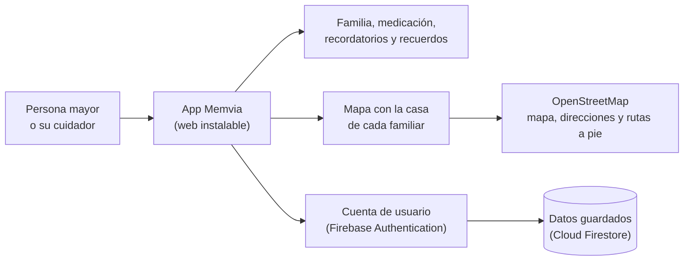
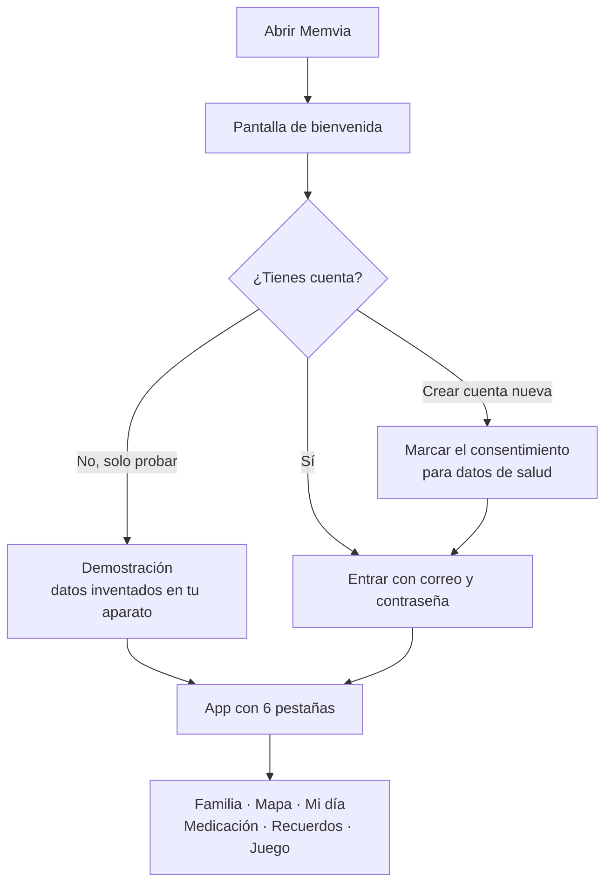
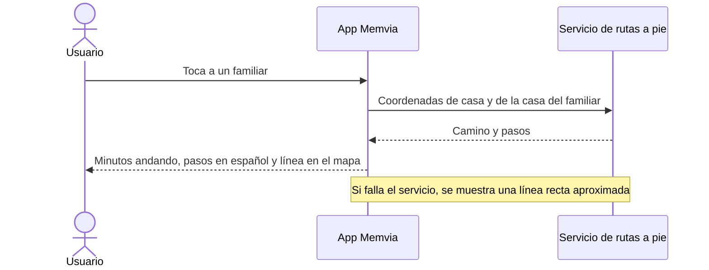
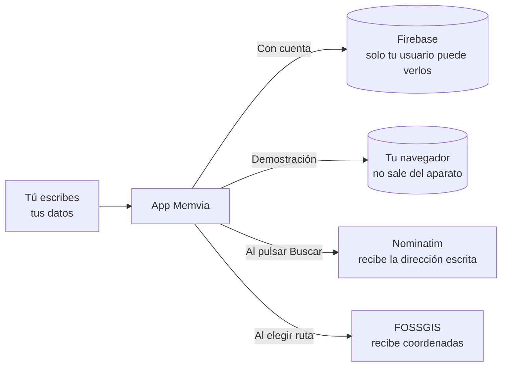

### Proyecto para **Coolest Projects**.
### Alejandro Narvaez Jaime | Codelearn Gava


# Memvia · Tu gente, siempre cerca

Memvia es una app para ayudar a las personas con alzheimer. Muestra a la familia con su cara y su nombre, dice quién es cada persona y **dónde vive**, en un mapa real, con el camino a pie desde casa. También ayuda con la medicación, las tareas del día y los recuerdos.


## Qué hace

- **Familia**: foto (o icono), nombre, parentesco y una frase especial. Un toque y la app lo lee en voz alta. Llamada y WhatsApp con un botón.
- **Mapa real** (OpenStreetMap): casa de cada familiar y lugares importantes (farmacia, centro de salud...). Al tocar uno se ve cuánto se tarda **andando** y los pasos del camino, escritos en español. También hay un **esquema** sencillo de distancias que funciona sin internet.
- **Mi día**: recordatorios con hora y aviso.
- **Medicación**: horarios y registro de tomas.
- **Recuerdos**: pequeñas historias de la familia.
- **Juego**: "¿Quién es?", para ejercitar la memoria con las caras de la familia.
- **SOS**: llama a un familiar.
- **Hecha para leer fácil**: modo simple, letra grande, tema claro / oscuro / automático, botones grandes.
- **Cuentas** (Firebase): un cuidador puede preparar los datos y la persona los ve en su dispositivo.
- **Modo demostración**: se prueba sin cuenta, con datos inventados que solo se guardan en ese dispositivo.
- **Se instala como app** (PWA) en el móvil, y abre sin internet para ver lo ya guardado.

## Cómo funciona

**Las piezas de Memvia**



**Qué pasa al abrir la app**



**Qué pasa al tocar a un familiar en el mapa**



**A dónde van los datos**



## Probarla

En tu ordenador, con cualquier servidor estático:

```bash
python3 -m http.server 8080      # o: npx serve
```

y abre http://localhost:8080. No hay paso de compilación.

Pulsa **Probar sin cuenta (demostración)** para ver una demostración.

### Instalarla como app

- **Android (Chrome)**: menú ⋮ → *Instalar aplicación*.
- **iPhone (Safari)**: Compartir → *Añadir a pantalla de inicio*.
- **APK**: en <https://www.pwabuilder.com> pega la dirección https de la app y descarga el paquete para Android.

## Poner tu propia cuenta de Firebase

1. En <https://console.firebase.google.com> crea un proyecto, activa **Authentication → Correo y contraseña** y **Firestore**.
2. Copia la configuración web en `js/config.js`.
3. En Firestore → Reglas, pega el contenido de `firestore.rules`. Así cada persona solo puede leer y escribir **sus** datos.
4. En Authentication → Configuración → Dominios autorizados, añade el dominio donde publiques la app.

## Archivos

| Archivo | Función |
| --- | --- |
| `index.html` | Pantallas y diálogos |
| `css/styles.css` | Diseño, temas claro y oscuro, tamaños táctiles |
| `js/app.js` | Lógica: familia, mapa, rutas, medicación, cuentas, modo demo |
| `js/mapa.js` | Mapa Leaflet y marcadores |
| `js/buscador.js` | Buscador de direcciones (elige tú el resultado correcto) |
| `js/geo.js` | Direcciones (Nominatim) y rutas a pie (OSRM), con ruta aproximada si falla |
| `js/demo.js` | Datos de ejemplo inventados |
| `js/config.js` | Configuración de Firebase |
| `sw.js`, `manifest.webmanifest` | Instalación y modo sin conexión |
| `firestore.rules` | Reglas de seguridad de la base de datos |
| `privacidad.html` | Política de privacidad, bases legales y aviso legal |

## Privacidad y legal

- La app incluye `privacidad.html`: política de privacidad, bases legales (RGPD y LOPDGDD), derechos, destinatarios, cookies y aviso legal.
- **Antes de publicar, completa los datos entre `[[corchetes]]`** (responsable, correo de contacto y región de Firestore). Mientras falte alguno, la página muestra un aviso amarillo.
- Al crear una cuenta hay una casilla de **consentimiento explícito** para datos de salud (medicación). Se guarda con la versión de la política y la fecha. Si una cuenta antigua no lo tiene, la app lo pide al entrar.
- En Ajustes hay **Exportar copia** (portabilidad) y **Eliminar mi cuenta** (borra los datos y el usuario).
- Sin cuenta (demostración) nada sale del dispositivo, salvo búsquedas de dirección y rutas.
- Con cuenta, los datos están en Firebase (Google), sin cifrado de extremo a extremo. Las reglas de `firestore.rules` limitan cada documento a su dueño.
- Para el mapa se envían a terceros la IP y, al pulsar Buscar o elegir ruta, la dirección o las coordenadas (Nominatim, FOSSGIS). El resto de servicios están en la sección 6 de la política.
- Usa datos inventados, o permiso de la familia, en demos públicas.
- Si la app llega a muchas personas (datos de salud de personas vulnerables a gran escala), hace falta además una evaluación de impacto (art. 35 RGPD) y un registro de actividades de tratamiento. Consulta con un asesor jurídico o con el delegado de protección de datos de tu centro.

## Límites

- Memvia ayuda a recordar y orientarse. **No es un sistema de seguridad** ni sustituye a un cuidador.
- Las fotos se guardan dentro del documento de Firestore, que admite cerca de 1 MB. Con muchas fotos grandes la app avisa y no guarda.
- Los servicios gratuitos de OpenStreetMap, Nominatim y FOSSGIS son para poco volumen. La app busca solo al pulsar el botón y espera entre búsquedas.
- Los pasos de la ruta se traducen al español con reglas sencillas; algunas calles pueden sonar raras.
- El mapa, las búsquedas y las rutas necesitan internet.

 
