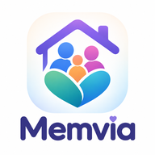

# Memvia · Tu gente, siempre cerca

**Una app para ayudar a las personas que olvidan cosas a reconocer a su familia, saber dónde vive y recordar su día.**

[**▶ Probar la app**](https://alejandro22410.github.io/prueba/)

Proyecto para **Coolest Projects** · Alejandro Narvaez Jaime · Codelearn Gava

---

## 🧠 ¿Qué problema resuelve?

Una persona con alzheimer, demencia o pérdida de memoria puede olvidar quién es cada familiar, dónde vive o si ya se tomó la pastilla.

Memvia lo pone todo en una pantalla grande y sencilla. Un familiar o cuidador la prepara una vez, y la persona solo tiene que tocar.

## ✨ ¿Qué hace?

- 👨‍👩‍👧 **Familia:** la cara y el nombre de cada familiar. Al tocarlo, la app dice en voz alta quién es. Se puede llamar o escribir por WhatsApp con un botón.
- 🗺️ **Mapa:** muestra dónde vive cada familiar y cuánto se tarda **andando** desde casa, con los pasos del camino.
- 📅 **Mi día:** tareas con hora y avisos que suenan y salen en el móvil.
- 💊 **Medicación:** a qué hora toca cada pastilla y si ya se ha tomado.
- ❤️ **Recuerdos:** pequeñas historias de la familia.
- 🎮 **Juego «¿Quién es?»:** para ejercitar la memoria con las caras de la familia.
- 🆘 **Botón SOS:** llama a un familiar.
- 🔠 **Fácil de usar:** letra grande, botones grandes, modo simple y modo oscuro.

## 🚀 Pruébala

1. Abre <https://alejandro22410.github.io/prueba/>
2. Pulsa **«Probar sin cuenta (demostración)»**. Son datos inventados, no hace falta registrarse.

**Instalarla en el móvil:**
- **Android (Chrome):** menú ⋮ → *Instalar aplicación*.
- **iPhone (Safari):** Compartir → *Añadir a pantalla de inicio*.

## 🔔 Los avisos

Las tareas y las pastillas avisan con voz y con notificación. Si pasa la hora y no se marca, aparece un cuadro «Se te ha pasado hoy».

Si la app está cerrada del todo, el móvil puede no avisar. Por eso se puede llevar los avisos al **calendario del móvil** (en Ajustes), que sí suena aunque Memvia esté cerrada.

## 🔒 Privacidad

- Cada persona solo ve **sus** datos.
- Se pide permiso explícito para guardar datos de salud, como la medicación.
- Se pueden **descargar** los datos o **borrar la cuenta** cuando se quiera.
- La demostración no guarda nada fuera del aparato.
- Más detalle en la [política de privacidad](privacidad.html).

## ⚠️ Límites

- Memvia **ayuda a recordar**, pero no es un sistema de seguridad ni sustituye a un cuidador o a un médico. En una emergencia, llama al 112.
- El mapa y las rutas necesitan internet, y las rutas son orientativas.
- Los avisos no son fiables si la app está cerrada del todo.
- Está probada con comprobaciones automáticas, pero todavía no con lectores de pantalla ni con personas reales.

## 🔭 Ideas futuras

- Avisos que suenen siempre, aunque la app esté cerrada.
- Videollamada al familiar desde su ficha.
- Que el cuidador cambie los datos desde su móvil y la persona los vea al momento.
- Más idiomas (catalán, inglés).

---

Hecho por **Alejandro Narvaez Jaime** (Codelearn Gava) para Coolest Projects.
